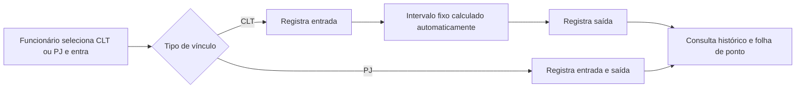

<p align="center">
  
</p>

<h1 align="center">KairoPont</h1>
<p align="center"><strong>Controle de jornada da Kairo Automações</strong></p>

<p align="center">
  <a href="https://oc-mateus.github.io/KairoPont/">Abrir aplicação</a> ·
  <a href="https://github.com/oc-mateus/KairoPont">Ver repositório</a>
</p>

---

O KairoPont organiza o registro de jornada, a consulta de históricos e a gestão de funcionários CLT e PJ. A aplicação web fica no GitHub Pages; autenticação, banco de dados e arquivos usam o Supabase. O [Guia do Projeto](docs/GUIA_DO_PROJETO.md) reúne os fluxos, regras de negócio, estrutura técnica e procedimentos de operação.

## Como funciona



O Supabase valida o tipo de vínculo e a sequência das marcações e grava os horários oficiais no servidor, no fuso de São Paulo. Funcionários PJ registram entrada e saída e acompanham o total de horas trabalhadas; funcionários CLT também registram somente entrada e saída, com almoço fixo calculado a partir do turno. O funcionário consulta os próprios registros e pode exportar o histórico.

### Recursos

| Funcionário | Administrador |
| --- | --- |
| Escolher CLT ou PJ no login e registrar o próprio ponto | Acompanhar faltas, atrasos e horas extras de CLT |
| Consultar o próprio histórico | Gerenciar perfis e status de funcionários |
| Exportar folha de ponto em PDF ou Excel | Pesquisar funcionários por nome, CPF e cargo e ordenar alfabeticamente |
| Solicitar redefinição de senha pela tela de login | Distinguir CLT/PJ e ver resumo de horas PJ e extras CLT |

O painel de frequência filtra mês atual, mês/ano específico, últimos seis meses ou último ano; mostra os gráficos gerais primeiro e permite selecionar um funcionário CLT para ver os mesmos indicadores no mesmo período. Quando um mês específico não tem registros CLT, o painel informa que não há dados para aquele período. A folha de ponto identifica o vínculo; CLT apresenta turno e almoço fixo, enquanto PJ apresenta apenas entrada, saída e horas computadas. O cálculo de faltas, atrasos e horas extras considera funcionários CLT ativos e não inclui administradores.

Funcionários CLT podem enviar e consultar documentos autorizados e acessar férias. Essas áreas não são exibidas para contas PJ, que usam o ponto apenas para registrar e acompanhar as horas trabalhadas. Na administração, a seção de férias da ficha também é exclusiva para CLT.

Na tela de login, administradores são encaminhados diretamente ao Painel Admin; funcionários CLT e PJ seguem para Registrar Ponto. A recuperação de senha funciona para os três tipos de conta e direciona o usuário à página para cadastrar uma nova senha.

O cadastro cria perfis de funcionário. A atribuição do papel de administrador é feita de forma controlada no banco, nunca pelo frontend.

## Privacidade e situação atual

- As políticas RLS limitam funcionários aos próprios dados; ações administrativas exigem perfil de administrador.
- O bucket `documentos` é privado. O bucket de fotos de perfil é público para exibir avatares.
- A tela valida formato e tamanho de arquivo; configure também limites e tipos aceitos no Storage para impor essas restrições no servidor.
- O acesso é feito com e-mail e senha, com seleção do vínculo CLT/PJ validada contra o cadastro do funcionário. Administradores podem usar qualquer opção. O CPF é solicitado no cadastro e usado para identificar o funcionário, não para entrar.

O site está publicado. A URL padrão do Supabase Auth e o endereço permitido para redefinição de senha usam `https://oc-mateus.github.io/KairoPont/` e `https://oc-mateus.github.io/KairoPont/definir-senha`. Antes do uso operacional, revise as credenciais da conta administrativa de teste, confirme a entrega de e-mails do Auth e configure os limites de arquivo no Storage.

## Desenvolvimento local

Requisitos: Node.js 18 ou superior, npm e acesso ao Supabase `KairoPont`.

```bash
npm install
cp .env.example .env
npm run dev
```

Preencha no `.env` local `VITE_SUPABASE_URL` e `VITE_SUPABASE_ANON_KEY` com os valores públicos apropriados ao cliente. Não envie `.env`, chaves privilegiadas, senhas ou tokens ao GitHub.

## Banco e publicação

As migrações devem ser aplicadas na ordem em que estão nomeadas em [`supabase/migrations`](supabase/migrations). O workflow [Publicar no GitHub Pages](.github/workflows/pages.yml) constrói e publica a branch `main`. As variáveis de build são configuradas no GitHub em **Settings → Secrets and variables → Actions → Variables**.

As instruções de configuração estão descritas nas migrações SQL, no workflow e nas variáveis do repositório.
